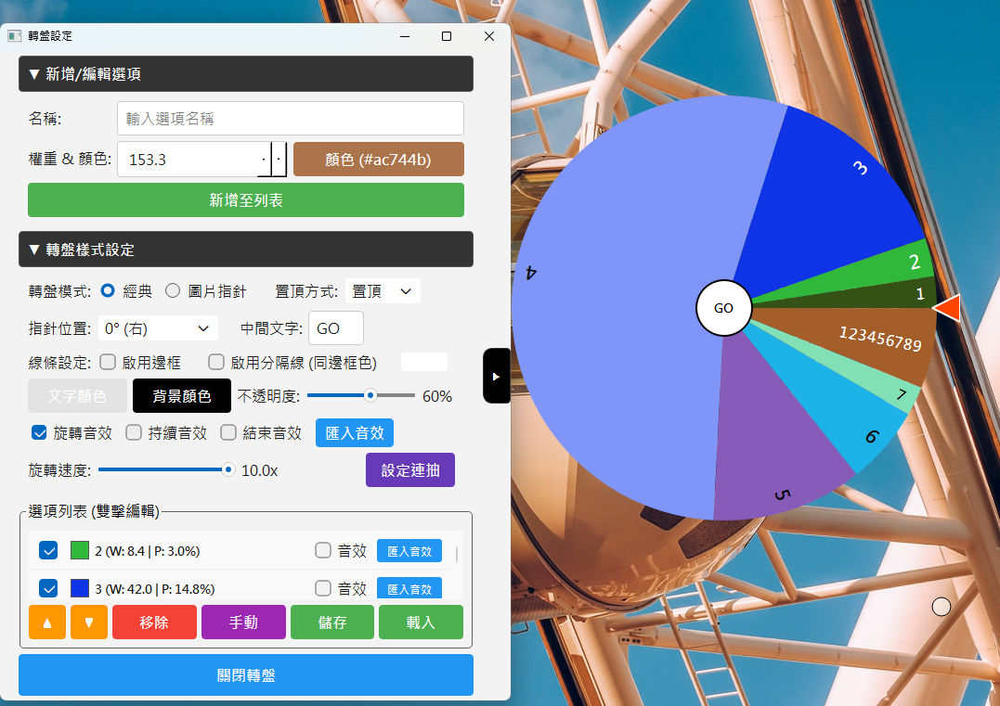

# WHEE - 自定義轉盤 (Customizable Spinning Wheel)

這是一個高度靈活且可自定義的轉盤應用程式，專為抽獎、決策制定以及實況直播使用而設計。

## 功能特色

-   **雙重視覺模式**：
    -   **經典模式**：傳統轉盤模式，轉盤相對於固定指針旋轉。
    -   **圖片指針模式**：指針（自定義圖片）繞著固定的轉盤背景旋轉。
-   **進階自定義**：
    -   **權重調整**：可為每個選項設定不同的機率權重。
    -   **視覺風格**：自定義選項顏色、可調整的邊框顏色，以及輔助線樣式（包含高對比外框）。
    -   **圖片支援**：可匯入自定義圖片作為中心指針。
-   **音效整合**：
    -   支援自定義 **Tick (指針撥動聲)**、**Loop (旋轉循環聲)** 和 **Finish (結束音效)**。
    -   相容 `.mp3` 與 `.wav` 格式。
-   **直播疊加與透明支援**：
    -   **透明背景**支援，適合 OBS 等直播軟體疊加使用。
    -   **視窗置頂**選項。
    -   無邊框視窗設計，視覺整合更乾淨。
-   **物理引擎**：
    -   流暢的加速與逼真的減速物理效果。

## 快速開始

1.  執行 `main.py` 啟動應用程式。
2.  使用 **設定視窗 (Config Window)** 新增選項、更改顏色並調整設定。
3.  點擊中心按鈕開始旋轉！
